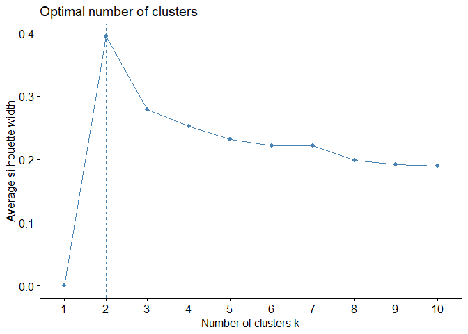
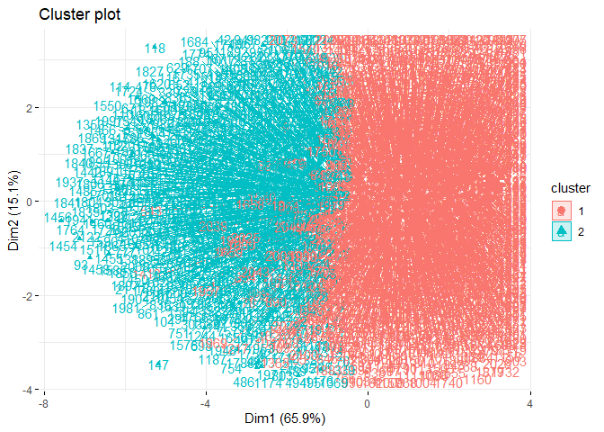
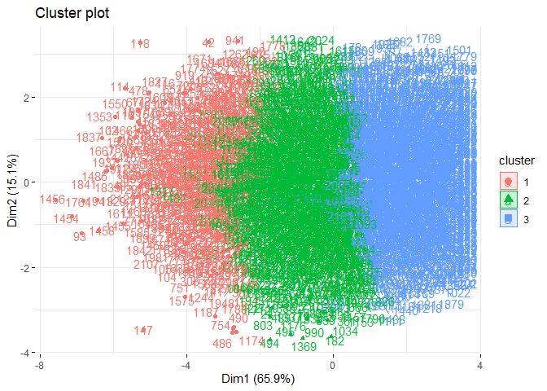
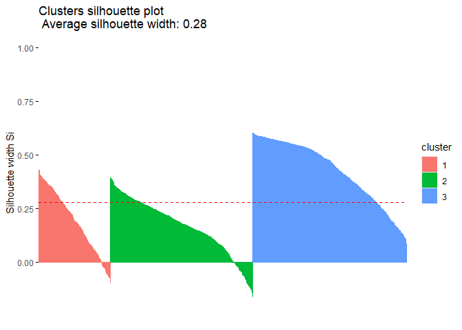
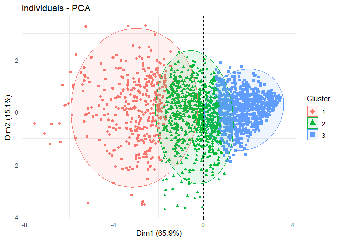
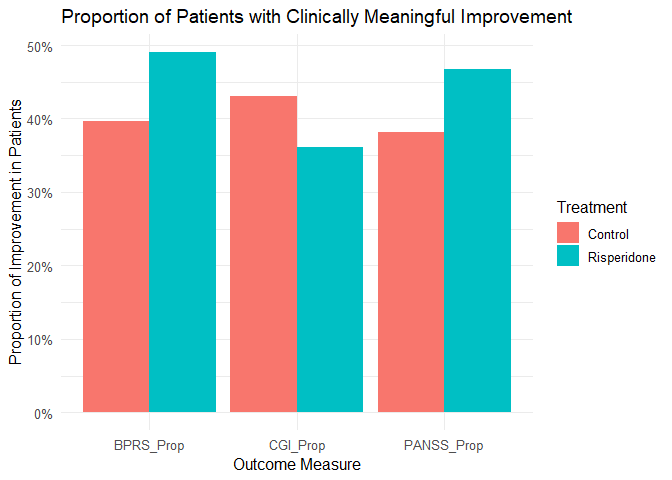

# Schizophrenia PANSS Analysis


## 1. Loading data & installing packages

Installing packages

``` r
#install.packages(c("tidyverse", "cluster", "factoextra", "NbClust", "Rtsne"))
```

Calling packages

``` r
library(tidyverse)
```

    ── Attaching core tidyverse packages ──────────────────────── tidyverse 2.0.0 ──
    ✔ dplyr     1.1.4     ✔ readr     2.1.5
    ✔ forcats   1.0.0     ✔ stringr   1.5.1
    ✔ ggplot2   3.5.2     ✔ tibble    3.3.0
    ✔ lubridate 1.9.4     ✔ tidyr     1.3.1
    ✔ purrr     1.1.0     
    ── Conflicts ────────────────────────────────────────── tidyverse_conflicts() ──
    ✖ dplyr::filter() masks stats::filter()
    ✖ dplyr::lag()    masks stats::lag()
    ℹ Use the conflicted package (<http://conflicted.r-lib.org/>) to force all conflicts to become errors

``` r
library(cluster)
library(factoextra)
```

    Welcome! Want to learn more? See two factoextra-related books at https://goo.gl/ve3WBa

``` r
library(NbClust)
library(Rtsne)
```

Installing database from GitHub:

``` r
#install.packages("devtools")
#devtools::install_github("florianstijven/Surrogate-development")
```

Data calling:

``` r
library(Surrogate)
data("PANSS")
```

Checking data:

``` r
head(PANSS)
```

           Pat.ID Treat          Invest Neg Exc Cog Pos Dep Total
    1   FIN-001_1     1 Investigator_32  23   7  12  15  12    80
    2  FIN-001_10    -1 Investigator_32  20  11  14  17  14    90
    3 FIN-001_100    -1 Investigator_22   8  13  24  18  12    89
    4 FIN-001_101    -1 Investigator_22  11   7   5   8   5    42
    5 FIN-001_105     1 Investigator_32  30   6  17  13  13    94
    6 FIN-001_106     1 Investigator_32  24   5  13  13  14    81

## 2. Clustering Data

Selecting only symptom variables:

``` r
panss_vars <- PANSS %>%
  select(Neg, Exc, Cog, Pos, Dep, Total)
```

Scaling variables:

``` r
panss_scaled <- scale(panss_vars)
```

Deciding number of clusters:

- we’re using the silhouette method which allows us to measure how
  similar each patient is to its own cluster compared to others.

``` r
colSums(is.na(panss_vars))
```

      Neg   Exc   Cog   Pos   Dep Total 
        1     1     1     2     2     6 

``` r
panss_vars <- na.omit(panss_vars)
```

``` r
panss_scaled <- scale(panss_vars)
```

``` r
fviz_nbclust(panss_scaled, kmeans, method = "silhouette")
```



### Clustering Data - 2 subtypes

Using kmeans()  
- setting seed to 123 allows us to get the same results  
- setting clusters to 2 as that is the optimal number  
- setting nstart to 25 to perform 25 times with different starts –\>
allows stability and reliability

``` r
set.seed(123)   # reproducibility
km_res <- kmeans(panss_scaled, centers = 2, nstart = 25) 
```

Visualization:

- using fviz_cluster to show 2D scatterplot

``` r
fviz_cluster(km_res, data = panss_scaled,
             ellipse.type = "euclid", repel = TRUE,
             ggtheme = theme_minimal())
```



Summary Table:

``` r
PANSS_complete <- PANSS[complete.cases(PANSS[, c("Neg","Exc","Cog","Pos","Dep","Total")]), ]

summary_table <- PANSS_complete %>%
  mutate(cluster = km_res$cluster) %>%
  group_by(cluster) %>%
  summarise(across(c(Neg, Exc, Cog, Pos, Dep, Total), mean, .names = "mean_{col}"),
            n = n())

print(summary_table)
```

    # A tibble: 2 × 8
      cluster mean_Neg mean_Exc mean_Cog mean_Pos mean_Dep mean_Total     n
        <int>    <dbl>    <dbl>    <dbl>    <dbl>    <dbl>      <dbl> <int>
    1       1     15.0     6.08     10.3     9.67     8.83       60.7  1218
    2       2     22.9    12.2      17.2    18.9     15.0       104.    723

Checking it compared to Treatment:

``` r
table(km_res$cluster, PANSS_complete$Treat)
```

       
         -1   1
      1 267 951
      2 226 497

#### Discussion

We could identify that cluster 1 had more patients with lower/mild
symptoms and cluster 2 had more severe symptoms. While there were more
patients under Risperidone in cluster 1, both still had a good majority
so it doesn’t necessarily tell us treatment effectiveness. While we
could not categorize specific subtypes, through this cluster we were
able to see how many patients were considered more “mild” and how many
were considered “severe”.

But what if we tried to see if there were just more than two subtypes?

### Clustering Data - 3 subtypes

``` r
fviz_nbclust(panss_scaled, kmeans, method = "silhouette")
```


trying with 3 subtype hypothesis:

``` r
set.seed(123)
km_res_subtype <- kmeans(panss_scaled, centers = 3, nstart = 25) 
```

``` r
fviz_cluster(km_res_subtype, data = panss_scaled,
             ellipse.type = "euclid", repel = TRUE,
             ggtheme = theme_minimal())
```



``` r
summary_table_2 <- PANSS_complete %>%
  mutate(cluster = km_res_subtype$cluster) %>%
  group_by(cluster) %>%
  summarise(across(c(Neg, Exc, Cog, Pos, Dep, Total), mean, .names = "mean_{col}"),
            n = n())

print(summary_table_2)
```

    # A tibble: 3 × 8
      cluster mean_Neg mean_Exc mean_Cog mean_Pos mean_Dep mean_Total     n
        <int>    <dbl>    <dbl>    <dbl>    <dbl>    <dbl>      <dbl> <int>
    1       1     24.6    14.5     19.4     21.5     16.4       116.    378
    2       2     20.2     8.34    13.7     13.9     11.9        82.5   752
    3       3     12.8     5.52     8.93     8.46     7.97       53.3   811

#### Discussion

When looking at the summary table, we could see that we could look at
three different subtypes in terms of severity: cluster 1 being severe,
cluster 2 being moderate, and cluster 3 being mild.

Out of the symptom scores, we saw:

- Severe shows negative, positive, excitatory, cognitive are all high

- Moderate shows that negative is still relatively high but excitatory
  and cognitive drops

- Mild shows that scores are low accross the board, but negative remains
  proportionally the largest factor.

Thus, we could broadly say that

- Cluster 1 is our “Globally severe” subtype

- Cluster 2 is our “Moderate, negative-dominant” subtype

- Cluster 3 is our “Mild residual” subtype.

### Validating Clusters

``` r
#install.packages("dplyr")
```

``` r
library(dplyr)
```

``` r
panss_cols <- c("Neg", "Exc", "Cog", "Pos", "Dep", "Total")
```

``` r
panss_data <- PANSS_complete
panss_data$cluster <- km_res_subtype$cluster
```

``` r
X <- scale(panss_data[, panss_cols])
```

#### Understanding silhouette score

Computing this score allows us to see the silhouette width for each
patient, which tells how well each patient fits in its assigned cluster.

By using X, our standardized PANSS data, we can compte a distance matrix
between all patients based on their PANSS scores. The silhouette width
can be considered as follows:

- s(i) is close to 1 –\> patient is well inside its cluster

- s(i) is close to 0 –\> patient is near the boundary

- s(i) is below 0 –\> patient may be misclassified

``` r
# 1. Silhouette score
sil <- silhouette(as.numeric(panss_data$cluster), dist(X))
fviz_silhouette(sil)
```

      cluster size ave.sil.width
    1       1  378          0.19
    2       2  752          0.17
    3       3  811          0.43



The below code performs a principal component analysis (PCA) on our X
data. The graph can be interpreted as follows:

- Clusters: points of the same color form a cloud –\> represents
  patients in the same cluster; ellipse size shows how tightly clustered
  they are

- Overlap: if ellipses overlap, it shows that they are not sharply
  separated, if they are distinct, they show strong separation

``` r
pca_res <- prcomp(X)
fviz_pca_ind(pca_res,
             geom.ind = "point",
             col.ind = as.factor(panss_data$cluster),
             addEllipses = TRUE,
             legend.title = "Cluster")
```



#### Discussion

We can see that there is a more overlap between cluster 1 (severe) and
cluster 2 (moderate), which shows that they are harder to separate. This
is actually aligns with the continual nature of symptom severity.

However, we can definitely see that cluster 3 (mild) is the “distinct,
cleanest” group, which also made clinical sense as it showed that they
have low symptom severity across all PANSS domains.

Therefore, while our three subtypes remain clinically viable, the
statistical viability allows us to understand that the moderate overlap
should be proceeded with caution when categorizing between moderate vs
severe subtypes.

### Shiny App

In addition to static clustering results, I built a small Shiny app to
make the clustering analysis interactive. Instead of only looking at
k-means results on PCA dimensions, the app lets you cluster patients
directly on their PANSS subscale scores (Negative, Positive, Cognitive,
Depressive, etc.) and adjust the number of clusters. This makes it
easier to see how different symptom patterns group together and explore
the data from different angles.

[Launch Shiny App](https://yurimnam.shinyapps.io/PANSS_Analysis/)

``` r
# app.R
library(shiny)

set.seed(123)
df <- PANSS_complete

# Define UI
ui <- fluidPage(
  titlePanel("PANSS Patient Clustering Dashboard"),
  
  sidebarLayout(
    sidebarPanel(
      # User input: number of clusters
      sliderInput("k", "Number of Clusters:",
                  min = 2, max = 8, value = 3),
      
      # Choose variables for clustering
      selectInput("xvar", "X-axis variable:",
                  choices = c("Neg","Exc","Cog","Pos","Dep","Total"), selected = "Neg"),
      selectInput("yvar", "Y-axis variable:",
                  choices = c("Neg","Exc","Cog","Pos","Dep","Total"), selected = "Pos"),
       # Filter by treatment
      selectInput("treatment", "Filter by Treatment Arm:",
                  choices = c("All", "-1 (Control)", "1 (Risperidone)"), selected = "All")
    ),
    
    mainPanel(
      plotOutput("clusterPlot"),
      tableOutput("clusterSummary")
    )
  )
)

# Define server logic
server <- function(input, output) {
  
    # Reactive filtered dataset
  filteredData <- reactive({
    if (input$treatment == "All") {
      df
    } else if (input$treatment == "-1 (Control)") {
      df %>% filter(Treat == -1)
    } else {
      df %>% filter(Treat == 1)
    }
  })
  
  # Perform clustering
  clusters <- reactive({
    df_sub <- filteredData()[, c("Neg","Exc","Cog","Pos","Dep","Total")]
    kmeans(scale(df_sub), centers = input$k, nstart = 25)
  })
  
  # Cluster plot
  output$clusterPlot <- renderPlot({
    clust_res <- clusters()
    plot_df <- filteredData() %>%
      mutate(Cluster = factor(clust_res$cluster))
    
    ggplot(plot_df, aes_string(x = input$xvar, y = input$yvar, color = "Cluster")) +
      geom_point(alpha = 0.6) +
      theme_minimal() +
      labs(title = paste("K-means Clustering with", input$k, "clusters"),
           x = input$xvar, y = input$yvar)
  })
  
    # Cluster summary stats
  output$clusterSummary <- renderTable({
    clust_res <- clusters()
    plot_df <- filteredData() %>%
      mutate(Cluster = factor(clust_res$cluster))
    
    plot_df %>%
      group_by(Cluster) %>%
      summarise(across(c(Neg, Exc, Cog, Pos, Dep, Total), mean, .names = "mean_{col}"))
  })
}

shinyApp(ui = ui, server = server)
```

<div style="width: 100% ; height: 400px ; text-align: center; box-sizing: border-box; -moz-box-sizing: border-box; -webkit-box-sizing: border-box;" class="muted well">Shiny applications not supported in static R Markdown documents</div>

## 3. Longitudinal Data comparison - Failed

As now we know the clusters, we would like to see if clusters improve
differently over time through treatment.

``` r
library(Surrogate)
data("Schizo_PANSS")
```

``` r
head(Schizo_PANSS)
```

        Id InvestId Treat Week1 Week2 Week4 Week6 Week8 Week1_bin Week2_bin
    1 1244      139     1   -10   -16   -17   -24   -30         0         0
    2  529      139     1    -7   -18   -22   -29   -30         0         0
    3  294      139     1    -5    -9   -17   -21    NA         0         0
    4  587      139    -1     2    -3   -12    -4    -4         0         0
    5 1340      139     1    15     2    -7   -10   -15         0         0
    6 1698      139    -1     4    -7    -8    -6    -9         0         0
      Week4_bin Week6_bin Week8_bin
    1         0         1         1
    2         1         1         1
    3         0         0        NA
    4         0         0         0
    5         0         0         0
    6         0         0         0

Integrating cluster assignment to our longitudinal data.  
  
but first, making copies so it doesn’t disturb our original data:

``` r
Long_data <- Schizo_PANSS
Complete_data <- PANSS_complete
```

``` r
# Complete_data: extract numeric part from Pat.ID and Invest
Complete_data$Pat.Id <- as.character(Complete_data$Pat.ID)

# Extract everything after the last underscore
Complete_data$Pat.Id <- sub(".*_", "", Complete_data$Pat.ID)

# Convert to character just to be safe
#Complete_data$Pat.Id <- as.numeric(Complete_data$Pat.Id)

# Extract digits after "Investigator_"
#Complete_data$InvestId <- sub(".*Investigator_(\\d+).*", "\\1", #Complete_data$Invest)

# Convert to character
##Complete_data$InvestId <- as.numeric(Complete_data$InvestId)

# Long_data: convert to character
#Long_data$Id <- as.numeric(Long_data$Id)
#Long_data$InvestId <- as.numeric(Long_data$InvestId)
```

``` r
# Convert patient ID in longitudinal data to character
Long_data$Id <- as.character(Long_data$Id)

# Optionally convert numeric columns for change scores
weeks <- paste0("Week", c(1,2,4,6,8))
Long_data[weeks] <- lapply(Long_data[weeks], as.numeric)
```

merging:

``` r
cluster_df <- data.frame(
  Pat.Id = Complete_data$Pat.Id,
  cluster = km_res_subtype$cluster
)
```

``` r
Long_data_merged <- merge(
  Long_data,
  cluster_df,
  by.x = "Id",
  by.y = "Pat.Id",
  all.x = FALSE 
)
```

As I realized that the dataset would not merge successfully due to
incomparable patient ID and investigator ID even with correct coding, I
moved on from this specific dataset but worked with others.

## 4. Treatment vs Control effect on scores

By using score changes from before and after treatment (control vs
Risperidone) we want to identify their effects on continuous outcomes.

``` r
data("Schizo")
```

We are now working with not just PANSS scores but also BPRS and CGI
scores.

**BPRS** (Brief Psychiatric Rating Scale) is a clinician-rated scale
that measure psychiatric symptoms, ranging from depression, anxiety, and
unusual behavior. It has been widely used in schizphrenia clinical
trials to assess treatment effectiveness. There are 18 items in which
they are scored from 1 to 7. A higher score means greater psychiatric
symptom severity.

(<https://www.psychiatrictimes.com/view/bprs-brief-psychiatric-rating-scale>)

**CGI** (Clinical Global Impression) scale is also a widely-used
clinician-rated measures in psychiatry. It provides a global, overall
assessment of a patient’s illness severity and improvement over time.
CGI has three main parts, but usually the main two are CGI-Severity
(CGI-S) that measures how severe the patient’s illness is at a specific
time, and CGI-Improvement (CGI-I) that measures how much the patient has
improved or worsened relative to baseline. Like the BPRS, a higher score
means greater psychiatric symptom severity or worse improvement.
(<https://pmc.ncbi.nlm.nih.gov/articles/PMC2880930/>)

Using a combination of PANSS, BPRS and CGI, we can assess the
effectiveness of our treatment of choice (Risperidone) versus our
control.  
  
**T-test Significance in Change of Scores**

We performed a Welch two sample t-test to see if the presence of
Risperidone created a statistically significant change in the symptom
scores of the patients.

``` r
# PANSS change: Risperidone vs Control
t.test(PANSS ~ Treat, data = Schizo)
```


        Welch Two Sample t-test

    data:  PANSS by Treat
    t = 3.8874, df = 921.27, p-value = 0.0001086
    alternative hypothesis: true difference in means between group -1 and group 1 is not equal to 0
    95 percent confidence interval:
     2.249548 6.836839
    sample estimates:
    mean in group -1  mean in group 1 
           -11.47191        -16.01510 

``` r
# BPRS change
t.test(BPRS ~ Treat, data = Schizo)
```


        Welch Two Sample t-test

    data:  BPRS by Treat
    t = 3.4087, df = 917.25, p-value = 0.0006813
    alternative hypothesis: true difference in means between group -1 and group 1 is not equal to 0
    95 percent confidence interval:
     0.9724791 3.6120381
    sample estimates:
    mean in group -1  mean in group 1 
           -6.646067        -8.938326 

``` r
# CGI change
t.test(CGI ~ Treat, data = Schizo)
```


        Welch Two Sample t-test

    data:  CGI by Treat
    t = 3.1808, df = 879.64, p-value = 0.00152
    alternative hypothesis: true difference in means between group -1 and group 1 is not equal to 0
    95 percent confidence interval:
     0.09248325 0.39051202
    sample estimates:
    mean in group -1  mean in group 1 
            3.446529         3.205031 

#### Discussion

PANSS

- The p-value is around 0.0001, showing high significance.

- The mean change is higher on Risperidone then on control.

- The 95% confidence interval does not include 0, which confirms
  significance.

Interpretation: Risperidone lead to a significantly larger reduction in
PANSS scores compared to control.

BPRS

- The p-value is around 0.0007, showing significance.

- The mean change is higher on Risperidone then on control.

- The 95% confidence interval does not include 0, which confirms
  significance.

Interpretation: Risperidone lead to a significantly larger reduction in
BPRS scores compared to control.

CGI

- The p-value is around 0.0015, showing significance.

- The mean change is slightly higher on Risperidone then on control.

- The 95% confidence interval does not include 0, which confirms
  significance.

### Binary outcomes - Bar Plot visual

As there is also PANSS_Bin, BPRS_Bin and CGI_Bin which are binary
outcomes, we can compute proportions of patients with clinically
meaningful improvement for Risperidone vs control.

``` r
Schizo_clean <- Schizo %>%
  filter(!is.na(Treat) & !is.na(PANSS_Bin) & !is.na(BPRS_Bin) & !is.na(CGI_Bin))

# Compute proportion of improvement by treatment
binary_summary <- Schizo_clean %>%
  group_by(Treat) %>%
  summarise(
    PANSS_Prop = mean(PANSS_Bin),
    BPRS_Prop = mean(BPRS_Bin),
    CGI_Prop   = mean(CGI_Bin)
  )

binary_summary
```

    # A tibble: 2 × 4
      Treat PANSS_Prop BPRS_Prop CGI_Prop
      <int>      <dbl>     <dbl>    <dbl>
    1    -1      0.381     0.396    0.430
    2     1      0.467     0.490    0.361

``` r
library(tidyr)

binary_long <- binary_summary %>%
  pivot_longer(cols = PANSS_Prop:CGI_Prop,
               names_to = "Measure",
               values_to = "Proportion") %>%
  mutate(Treat = ifelse(Treat == 1, "Risperidone", "Control"))
```

``` r
library(ggplot2)

ggplot(binary_long, aes(x = Measure, y = Proportion, fill = Treat)) +
  geom_bar(stat = "identity", position = "dodge") +
  scale_y_continuous(labels = scales::percent_format(accuracy = 1)) +
  labs(
    title = "Proportion of Patients with Clinically Meaningful Improvement",
    x = "Outcome Measure",
    y = "Proportion of Improvement in Patients",
    fill = "Treatment"
  ) +
  theme_minimal(base_size = 12)
```



#### Discussion

As we can observe, BPRS and PANSS has shown more clinically meaningful
improvement in their proportions of patients. However interestingly
enough, CGI has shown a decrease in the proportion of improvement in
patients. After further research:

``` r
# Check mean CGI_Bin by treatment
table(Schizo_clean$Treat, Schizo_clean$CGI_Bin)
```

        
            0    1
      -1  302  228
      1  1013  573

``` r
# Or proportion
prop.table(table(Schizo_clean$Treat, Schizo_clean$CGI_Bin), margin = 1)
```

        
                 0         1
      -1 0.5698113 0.4301887
      1  0.6387137 0.3612863

We can see that this could have been caused by the fact that our patient
numbers were a lot bigger in our Risperidone sample size versus our
control, though a higher number of patients did show improvement. Thus,
we can say that Risperidone still has a good improvement scale overall
in terms of treatment effectiveness.

## 5. Conclusion

Our exploratory analysis of PANSS scores across multiple schizophrenia
clinical trials revealed distinct patient subgroups based on symptom
severity. Clustering analyses identified a “mild” cluster with
relatively lower PANSS scores and a “severe” cluster with elevated
negative and cognitive symptom dimensions. These results highlight the
heterogeneity of schizophrenia symptoms at the patient level.

From a data analyst perspective, these findings underscore the value of
quantitative approaches, such as clustering and longitudinal symptom
analysis, to uncover latent patterns in clinical data. Identifying these
subgroups may inform more targeted treatment strategies and provide a
framework for integrating patient-level variability into future
neurobiological and pharmacological studies.
